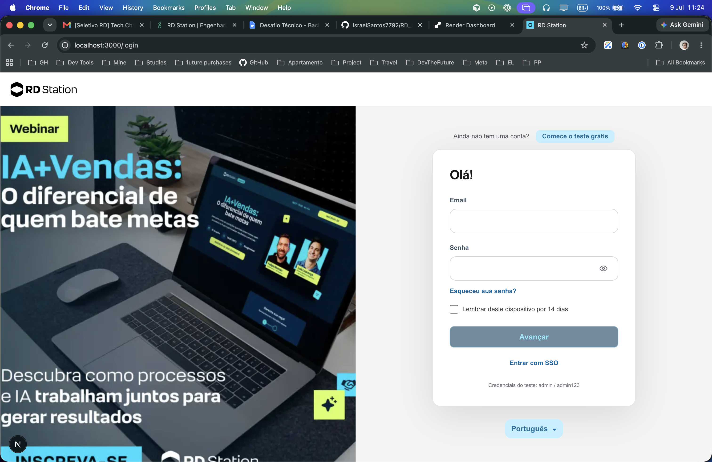
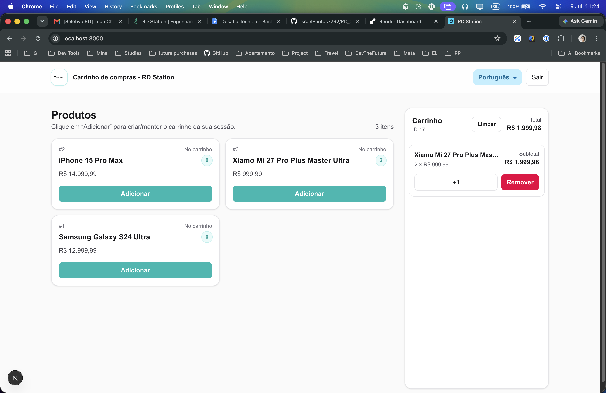

# Manager Cart — RD Station (frontend)

Interface web em **Next.js** para gerenciar um carrinho de compras. Consome a API REST em **Ruby on Rails**, que identifica o carrinho por sessão (cookies).

| Serviço   | Stack        | Porta padrão |
|-----------|--------------|--------------|
| Frontend  | Next.js 16   | `3000`       |
| Backend   | Rails 7.1    | `5050`       |

## Telas da aplicação

### Login (`/login`)



Tela de entrada inspirada no visual da RD Station. O layout é dividido em duas colunas:

- **Esquerda:** banner promocional do webinar (link externo para a RD Station).
- **Direita:** formulário de login com e-mail, senha, opção de lembrar dispositivo e seletor de idioma (PT, EN, ES).

A autenticação é **mock local** (não chama a API Rails). Use as credenciais de teste exibidas na própria tela:

| Campo   | Valor      |
|---------|------------|
| E-mail  | `admin`    |
| Senha   | `admin123` |

### Produtos e carrinho (`/`)



Após o login, a home exibe o catálogo e o carrinho da sessão atual:

- **Produtos (esquerda):** lista vinda do endpoint `GET /products`. Cada card mostra nome, preço e botão **Adicionar**, que cria ou atualiza o carrinho via `POST /cart`.
- **Carrinho (direita):** resumo da sessão (`GET /cart`), com ID do carrinho, total, quantidade por item, botão **+1** (`POST /cart/add_item`) e **Remover** (`DELETE /cart/:product_id`).
- **Header:** título da aplicação, seletor de idioma e botão **Sair** (limpa a sessão local do frontend).

O carrinho é mantido no backend por **cookie de sessão** — as requisições usam `credentials: "include"` para preservar o mesmo carrinho entre recarregamentos.

## Pré-requisitos

### Frontend

- Node.js 20+
- Yarn

### Backend (Rails)

- Ruby **3.3.1**
- Rails **7.1.3.2**
- PostgreSQL **16**
- Redis **7.0.15**

## Como rodar

Siga a ordem abaixo: o frontend depende da API no ar.

### 1. Backend (Rails na porta 5050)

No repositório da API Rails:

```bash
bundle install
bin/rails db:create db:migrate db:seed
PORT=5050 bundle exec rails server
```

A API ficará disponível em [http://localhost:5050](http://localhost:5050).

Em outro terminal, suba o Sidekiq (jobs de carrinhos abandonados):

```bash
bundle exec sidekiq
```

Garanta que PostgreSQL e Redis estejam rodando localmente (ou via Docker, conforme o README do backend).

### 2. Frontend (Next.js)

Neste repositório:

```bash
yarn install
cp .env.local.example .env.local
yarn dev
```

Abra [http://localhost:3000](http://localhost:3000).

O arquivo `.env.local` deve apontar para o backend:

```env
NEXT_PUBLIC_API_BASE_URL=http://localhost:5050
```

### 3. Login

Acesse [http://localhost:3000/login](http://localhost:3000/login) e entre com `admin` / `admin123`. Veja a seção [Telas da aplicação](#telas-da-aplicação) para um preview visual.

## Scripts do frontend

| Comando       | Descrição                   |
|---------------|-----------------------------|
| `yarn dev`    | Servidor de desenvolvimento |
| `yarn build`  | Build de produção           |
| `yarn start`  | Servidor de produção        |
| `yarn lint`   | ESLint                      |

## Endpoints usados pelo frontend

| Método   | Rota              | Uso                          |
|----------|-------------------|------------------------------|
| `GET`    | `/products`       | Listar produtos              |
| `GET`    | `/cart`           | Carrinho da sessão           |
| `POST`   | `/cart`           | Adicionar produto ao carrinho |
| `POST`   | `/cart/add_item`  | Incrementar quantidade       |
| `DELETE` | `/cart/:product_id` | Remover item do carrinho |

As requisições enviam `credentials: "include"` para manter o cookie de sessão do Rails.

## CORS

O backend precisa aceitar a origem do frontend (`http://localhost:3000`) com credenciais habilitadas. Se aparecer erro de CORS no navegador, confira o `config/initializers/cors.rb` da API Rails.

Se rodar o frontend em outra porta (ex.: `3001`), adicione essa origem no CORS do backend e reinicie o servidor Rails.

## Estrutura do projeto

```
app/
  page.tsx          # Home — produtos e carrinho
  login/page.tsx    # Tela de login
lib/
  api.ts            # Cliente HTTP da API Rails
  auth.ts           # Autenticação local (localStorage)
  i18n.ts           # Traduções (pt, en, es)
components/
  LanguageMenu.tsx  # Seletor de idioma
```

## Produção

```bash
yarn build
yarn start
```

Defina `NEXT_PUBLIC_API_BASE_URL` com a URL pública da API Rails no ambiente de deploy.
